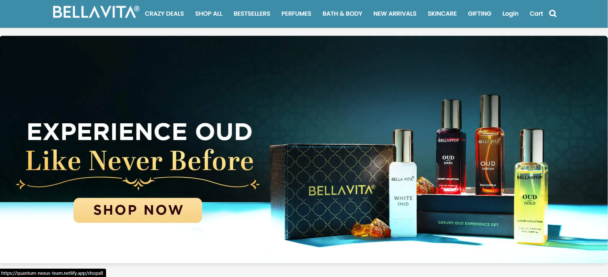
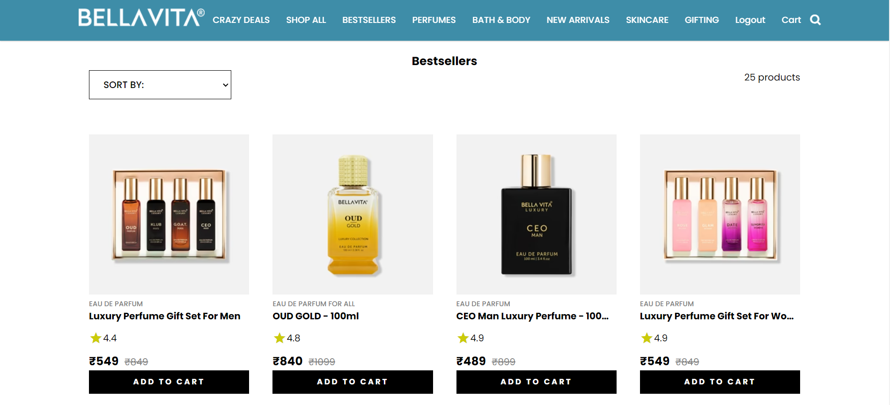
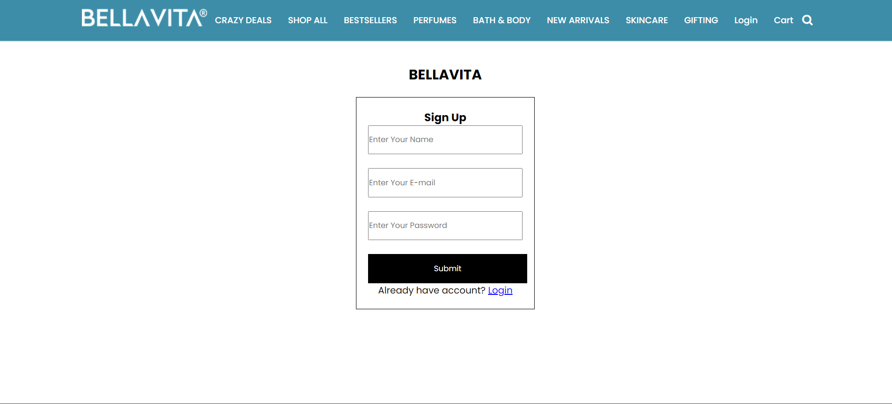
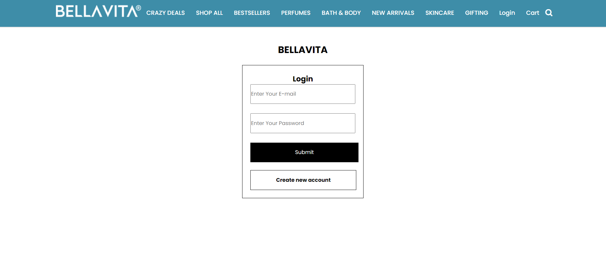
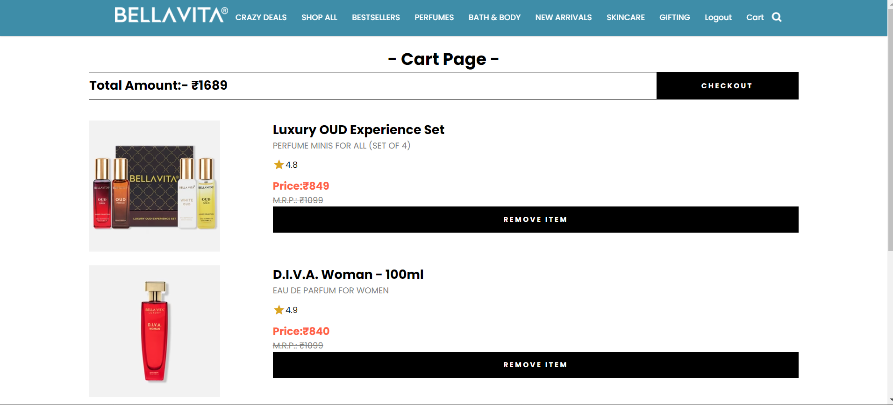

# Project Title:
## BELLAVITA CLONE

## [Link to Bellavita clone](https://quantum-nexus-team.netlify.app/)

Hello Everyone, my name is *Rohit Yadav*. And this is my project which was given to us in our construct week, were we have to clone a website called **Bellavita** using **HTML, CSS, JavaScript, DOM and LocalStorage**.
There were four members in our team including me:
## Team Members

1. [Rohit Yadav](#) - My task was to create some of the Product pages, Cart page, and Login/SignUp page and adding some functionality and authentication to it.
2. [Aparna Tiwari](#) - Her task was to create Home page and Checkout page.
3. [Shahrukh](#) - His task was to create Shop All product page.
4. [Uttam Mane](#) - His task was to create Navbar, Footer, and some of the Products pages.

## Screenshots

### Homepage

### Product Page

### Signup Page

### Login Page

### Cart Page

## Acknowledgments

I would like to thank all my team members for collaborating on the project.
